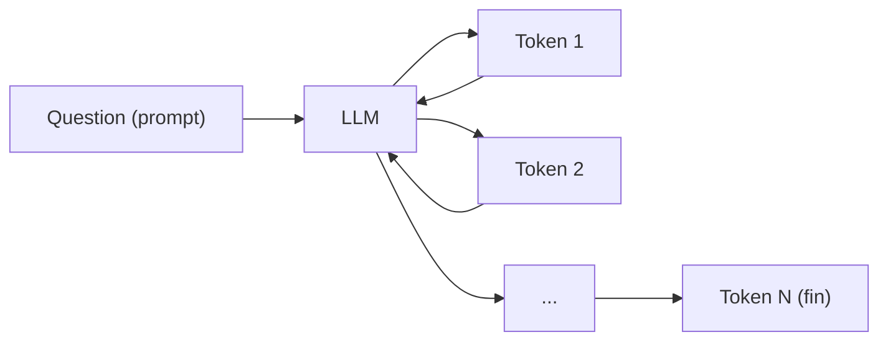
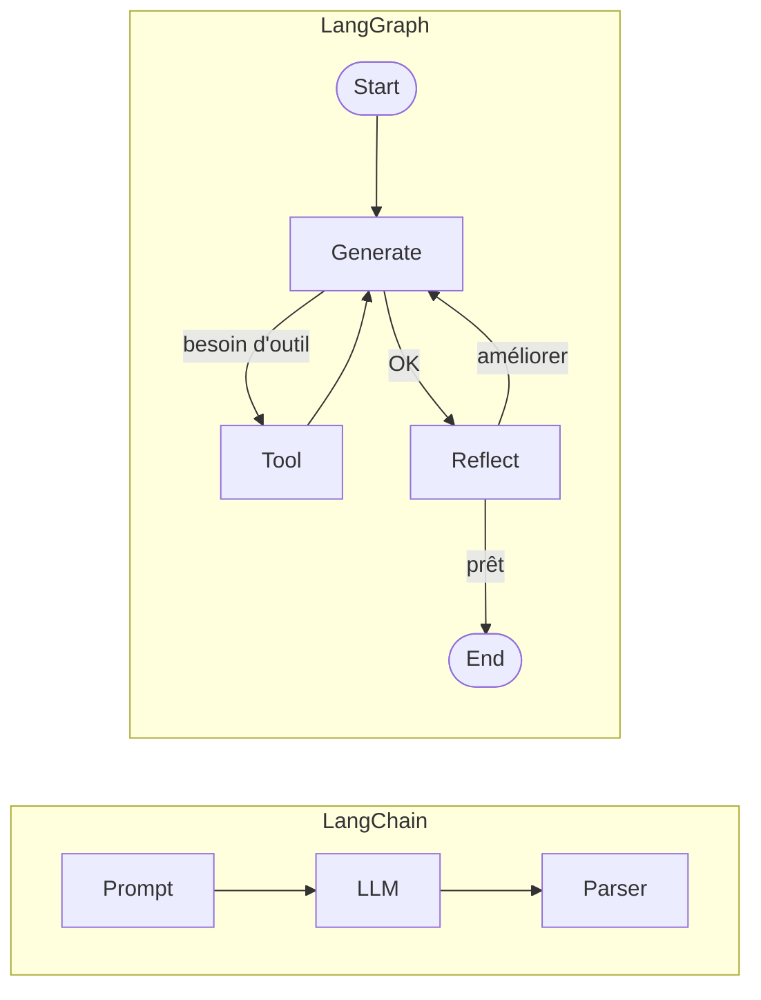
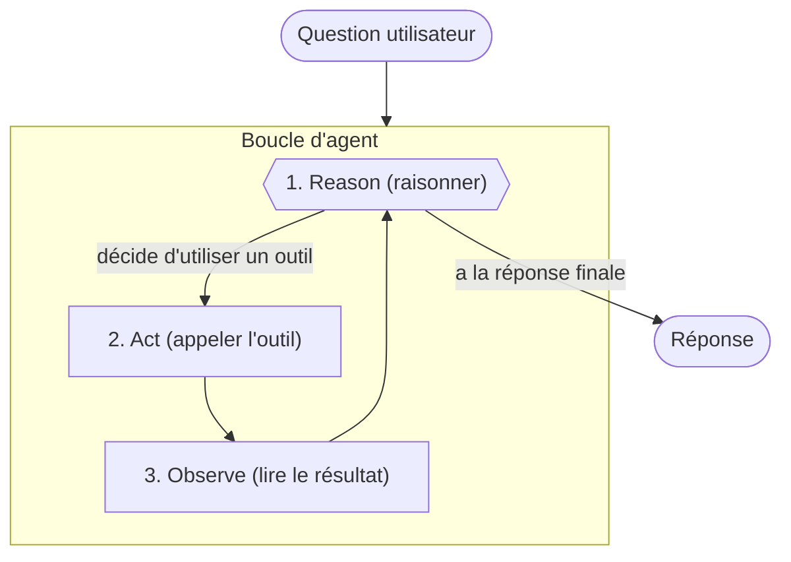
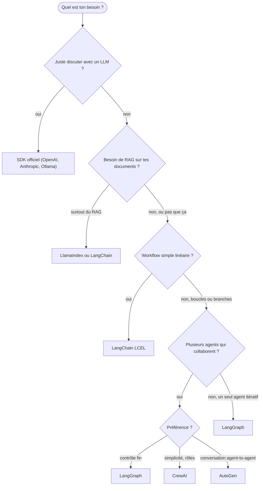
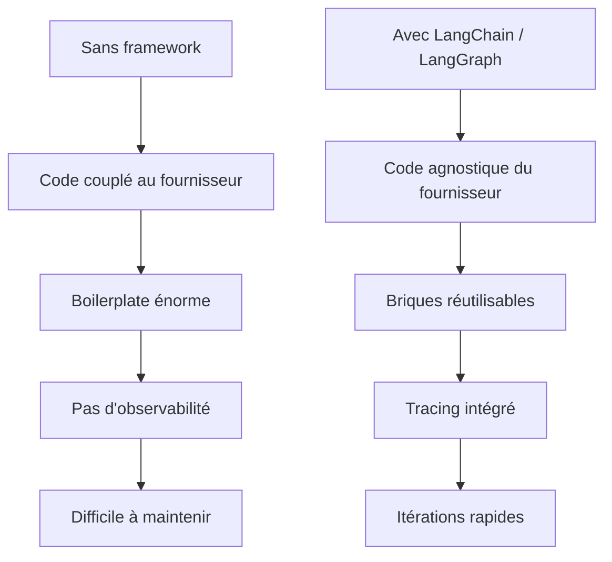

<a id="top"></a>

# Module 0 — Introduction à LangChain et à l'IA Agentique

> Avant de coder ton premier "Hello World" LangChain, prends 15 minutes pour comprendre **pourquoi** ces frameworks existent, **ce qu'ils résolvent**, et **où ils se situent** dans le paysage de l'IA générative.

## Table des matières

| #   | Section                                                                |
| --- | ---------------------------------------------------------------------- |
| 1   | [Pourquoi ce module](#section-1)                                       |
| 2   | [C'est quoi un LLM, vraiment ?](#section-2)                            |
| 3   | [Pourquoi un LLM seul ne suffit pas](#section-3)                       |
| 4   | [Qu'est-ce que LangChain ?](#section-4)                                |
| 4a  | &nbsp;&nbsp;↳ [Qu'est-ce que LangGraph ?](#section-4a)                 |
| 5   | [C'est quoi "Agentic AI" ?](#section-5)                                |
| 5a  | &nbsp;&nbsp;↳ [La boucle universelle d'un agent](#section-5a)          |
| 6   | [Le paysage des frameworks d'IA agentique](#section-6)                 |
| 6a  | &nbsp;&nbsp;↳ [Comment choisir un framework](#section-6a)              |
| 7   | [Concepts clés transverses](#section-7)                                |
| 8   | [Scénarios sans framework](#section-8)                                 |
| 8a  | &nbsp;&nbsp;↳ [Scénarios avec LangChain / LangGraph](#section-8a)      |
| 9   | [Tableau comparatif simple](#section-9)                                |
| 10  | [Glossaire express](#section-10)                                       |
| 11  | [Conclusion et prochaine étape](#section-11)                           |
| 12  | [Quiz d'auto-évaluation (50 questions)](./Module-00-quiz-introduction-LLM-LangChain-LangGraph-agent-RAG.md)                 |
| 13  | [Pratique Hello World (venv + Docker)](./Module-00-pratique-hello-world-venv-Docker.md)              |

---

<a id="section-1"></a>

## 1. Pourquoi ce module

<details>
<summary>1 - Pourquoi ce module (cliquer pour développer)</summary>

<br/>

Quand on découvre LangChain, le réflexe est souvent de copier-coller un script `Hello World`, voir « ça marche », et passer au suivant.

Le problème, c'est qu'on apprend des **commandes**, mais pas la **carte mentale**.

Ce module 0 a un seul objectif : t'installer la bonne **carte mentale** avant d'écrire la moindre ligne de code. À la fin de ce document, tu dois pouvoir répondre clairement à ces questions :

- Qu'est-ce qu'un LLM, en termes simples ?
- Pourquoi un LLM seul ne suffit pas pour une vraie application ?
- Qu'apporte LangChain par-dessus un LLM ?
- Quelle est la différence entre LangChain et LangGraph ?
- Qu'est-ce qu'un « agent » et qu'est-ce que l'« IA agentique » ?
- Quels autres frameworks existent ?
- Quand utiliser quel outil ?

> [!NOTE]
> Ce module ne contient **aucune** ligne de code à exécuter. C'est un cours de vocabulaire et de concepts. Le code commence au [Module 1](./01-cours.md).

</details>

<p align="right"><a href="#top">↑ Retour en haut</a></p>

---

<a id="section-2"></a>

## 2. C'est quoi un LLM, vraiment ?

<details>
<summary>2 - Comprendre un LLM en 5 minutes</summary>

<br/>

**LLM** veut dire **Large Language Model** — grand modèle de langage.

En une phrase : un LLM est un **gigantesque prédicteur de texte** entraîné sur d'énormes quantités de données pour deviner le **prochain mot** d'une phrase.

### Analogie simple

Pense à l'autocomplétion de ton clavier de téléphone :

- elle suggère le mot suivant en fonction de ce que tu viens de taper ;
- elle a été entraînée sur tes anciens messages.

Un LLM, c'est **la même idée**, mais :

- entraîné sur une grosse partie d'Internet (et plus encore) ;
- avec des milliards de paramètres internes ;
- capable de générer non pas un mot, mais des paragraphes entiers, du code, des résumés, du raisonnement étape par étape.

### Comment il « écrit »

Un LLM génère **token par token** (un token = un fragment de mot, environ 4 caractères en moyenne).



À chaque étape, le modèle regarde tout ce qui précède (la question + les tokens déjà générés) et calcule **le token le plus probable** ensuite. Puis il recommence.

### Ce qu'un LLM fait bien

- Reformuler, résumer, traduire.
- Écrire du code à partir d'une description.
- Expliquer un concept de plusieurs façons.
- Suivre des instructions générales (« réponds en JSON », « sois bref », etc.).
- Raisonner pas à pas si on lui demande explicitement.

### Ce qu'un LLM **ne fait pas** tout seul

- Aller chercher une information sur Internet en temps réel.
- Lire un fichier sur ton ordinateur.
- Exécuter du code Python pour vérifier un calcul.
- Se souvenir d'une conversation passée (chaque appel est isolé par défaut).
- Garantir une réponse 100 % factuelle.

> [!IMPORTANT]
> Un LLM est **statistique**, pas magique. Il ne « sait » pas. Il **prédit** ce qui ressemble le plus à une bonne réponse. C'est très puissant, mais ça ouvre la porte aux hallucinations (réponses qui sonnent juste mais sont fausses).

</details>

<p align="right"><a href="#top">↑ Retour en haut</a></p>

---

<a id="section-3"></a>

## 3. Pourquoi un LLM seul ne suffit pas

<details>
<summary>3 - Les limites concrètes d'un LLM nu</summary>

<br/>

Si tu essaies de construire une vraie application IA en appelant uniquement l'API OpenAI (ou Anthropic, Mistral, etc.) sans framework, tu vas rapidement rencontrer **cinq murs**.

### 3.1. Le mur de la connaissance figée

Un LLM est entraîné jusqu'à une certaine date (sa « cutoff date »). Tout ce qui est arrivé après cette date, il ne le connaît pas.

Exemple :
- Tu lui demandes « qui a gagné la dernière Coupe du monde ? »
- Si sa cutoff est antérieure à l'événement, il invente ou refuse.

→ Solution : lui donner accès à une **recherche web** ou à une **base de documents** (RAG).

### 3.2. Le mur de l'action

Un LLM seul ne peut pas :

- envoyer un email,
- créer une issue GitHub,
- exécuter une requête SQL,
- générer un graphique,
- appeler une API métier.

→ Solution : lui donner des **outils** (tools / function calling).

### 3.3. Le mur de la mémoire

Par défaut, chaque appel API est **indépendant**. Si l'utilisateur dit « mon nom est Alice » dans le message 1 et « comment je m'appelle ? » dans le message 2, le LLM ne saura pas si tu n'as pas réinjecté l'historique toi-même.

→ Solution : un système de **mémoire** (court terme, long terme, par utilisateur).

### 3.4. Le mur du format

Un LLM répond en texte libre. Mais ton application a souvent besoin d'un **JSON propre** ou d'un objet typé pour continuer le pipeline.

→ Solution : des **output parsers** (Pydantic, JSON schema, etc.).

### 3.5. Le mur de la robustesse

Un appel à un LLM peut :

- échouer (réseau, rate limit, modèle down) ;
- retourner du texte mal formé ;
- coûter cher si on l'appelle inutilement.

Sans framework, tu réécris à la main : retry, timeout, cache, parsing défensif, logs, traces, observabilité.

→ Solution : un framework qui te donne ces briques **prêtes à l'emploi**.

> [!NOTE]
> C'est exactement à ces 5 murs que LangChain, LangGraph et les autres frameworks d'IA agentique répondent.

</details>

<p align="right"><a href="#top">↑ Retour en haut</a></p>

---

<a id="section-4"></a>

## 4. Qu'est-ce que LangChain ?

<details>
<summary>4 - LangChain, expliqué simplement</summary>

<br/>

**LangChain** est une **boîte à outils open source** (Python et JavaScript) qui te donne des briques standardisées pour construire des applications basées sur des LLM.

L'image mentale la plus juste : **un set de Lego pour applications IA**.

### Les briques fournies

| Brique             | À quoi ça sert                                                       |
| ------------------ | -------------------------------------------------------------------- |
| `PromptTemplate`   | Modèle de message réutilisable avec variables                        |
| `ChatModel`        | Interface uniforme pour OpenAI, Anthropic, Ollama, Mistral…          |
| `OutputParser`     | Transforme la sortie texte en objet Python typé                      |
| `Tool` / `@tool`   | Une fonction que le LLM peut appeler                                 |
| `Agent`            | Un LLM + des outils + une boucle de raisonnement                     |
| `Retriever`        | Récupère les documents pertinents pour une question (RAG)            |
| `VectorStore`      | Base de données vectorielle (Pinecone, Chroma, FAISS…)               |
| `Memory`           | Système pour conserver l'historique d'une conversation               |
| `Runnable` / LCEL  | L'opérateur `|` pour assembler les briques                           |

### LCEL : LangChain Expression Language

LCEL, c'est le **langage de composition** de LangChain. L'idée tient en un caractère : `|`.

Exemple :

```python
chain = prompt | llm | parser
result = chain.invoke({"question": "Bonjour ?"})
```

Lecture : « envoie l'input dans le `prompt`, sa sortie dans le `llm`, sa sortie dans le `parser` ».

> [!IMPORTANT]
> LCEL n'est **pas** juste joli. Toute chaîne LCEL hérite gratuitement de :
> - `.invoke()` (synchrone),
> - `.ainvoke()` (asynchrone),
> - `.stream()` (streaming token par token),
> - `.batch()` (lot),
> - le tracing automatique avec LangSmith.

### Ce que LangChain te fait gagner

- Tu changes de fournisseur LLM en **changeant une ligne** (`init_chat_model("openai:gpt-4o")` → `init_chat_model("ollama:qwen3")`).
- Tu obtiens du streaming et de l'asynchrone sans coder une ligne de plus.
- Tu écris ton agent en quelques lignes avec `create_agent(...)`.
- Tu branches une centaine d'intégrations (Tavily, Pinecone, Chroma, SQL, Slack, GitHub, etc.) sans réécrire de wrapper.

### Ce que LangChain ne fait pas

- Il ne **remplace pas** un LLM. Il a toujours besoin d'un fournisseur (OpenAI, Anthropic, local…).
- Il ne **garantit pas** la qualité de la réponse. C'est toujours le LLM qui répond.
- Il ne **gère pas** seul des workflows ultra-complexes avec boucles et états multiples — c'est le rôle de **LangGraph**.

</details>

<p align="right"><a href="#top">↑ Retour en haut</a></p>

---

<a id="section-4a"></a>

## 4a. Qu'est-ce que LangGraph ?

<details>
<summary>4a - LangGraph et la différence avec LangChain</summary>

<br/>

**LangGraph** est une bibliothèque **complémentaire** à LangChain, conçue par la même équipe.

L'idée centrale : représenter ton application IA comme un **graphe d'états**.

### LangChain pense en chaînes, LangGraph pense en graphes



### À quoi sert LangGraph

- Construire des workflows avec **boucles** (générer → critiquer → générer encore).
- Maintenir un **état partagé** entre les étapes (messages, documents, scores).
- Faire des **edges conditionnels** (« si pertinent va à `generate`, sinon va à `web_search` »).
- Orchestrer des **agents multiples** qui collaborent.
- Implémenter les patterns avancés : Reflection, Reflexion, Plan-and-Execute, Adaptive RAG, Self-RAG.

### Quand utiliser quoi

| Besoin                                              | Outil recommandé        |
| --------------------------------------------------- | ----------------------- |
| Une chaîne linéaire (prompt → LLM → parser)         | LangChain (LCEL)        |
| Un agent simple avec des outils                     | LangChain `create_agent`|
| Une boucle de réflexion ou de révision              | LangGraph               |
| Un workflow avec branches et état                   | LangGraph               |
| Plusieurs agents qui collaborent                    | LangGraph               |

> [!NOTE]
> Tu utilises souvent **les deux ensemble** : tes nœuds LangGraph contiennent des chaînes LangChain LCEL. C'est complémentaire, pas concurrent.

</details>

<p align="right"><a href="#top">↑ Retour en haut</a></p>

---

<a id="section-5"></a>

## 5. C'est quoi "Agentic AI" ?

<details>
<summary>5 - L'IA agentique en mots simples</summary>

<br/>

L'**IA agentique** (ou **Agentic AI**), c'est l'évolution naturelle de l'IA conversationnelle.

| Génération d'IA   | Comportement                              |
| ----------------- | ----------------------------------------- |
| Chatbot classique | Tu parles, il répond. Point.              |
| LLM brut          | Idem, mais avec des réponses très riches. |
| RAG               | Idem, mais avec accès à tes documents.    |
| **Agent**         | **Il observe, décide, agit, et boucle.**  |

### La définition simple

> Un **agent IA** est un système qui peut **prendre des décisions** et **exécuter des actions** pour atteindre un objectif, sans qu'on lui dicte chaque étape.

Au lieu de « fais X », tu lui dis « atteins Y », et il choisit lui-même les actions intermédiaires.

### Exemple concret

**Sans agent (LLM brut) :**
- Toi : « combien d'offres d'emploi LangChain à Paris ? »
- LLM : « Je ne peux pas chercher en temps réel. Je peux te donner une estimation… »

**Avec agent (LLM + outils) :**
- Toi : « combien d'offres d'emploi LangChain à Paris ? »
- Agent : (réflexion) « j'ai besoin d'une recherche web. »
- Agent : appelle l'outil `tavily_search("offres LangChain Paris")`.
- Agent : (lit les résultats) « 23 offres trouvées sur LinkedIn et Indeed. »
- Agent : formule la réponse finale avec sources.

</details>

<p align="right"><a href="#top">↑ Retour en haut</a></p>

---

<a id="section-5a"></a>

## 5a. La boucle universelle d'un agent

<details>
<summary>5a - Reason → Act → Observe → repeat</summary>

<br/>

Tous les agents, peu importe le framework, suivent **la même boucle de base** :



| Étape    | Ce qui se passe                                                                   |
| -------- | --------------------------------------------------------------------------------- |
| Reason   | Le LLM décide : « est-ce que j'ai assez d'infos pour répondre, ou je dois agir ?» |
| Act      | Si action : il appelle un outil (recherche web, base SQL, exécution Python, etc.) |
| Observe  | Le résultat de l'outil est réinjecté dans la conversation                         |
| Repeat   | Le LLM relit tout, et décide à nouveau                                            |
| Stop     | Quand il a la réponse finale, il sort de la boucle                                |

> [!NOTE]
> Cette boucle a un nom historique : **ReAct** (Reasoning + Acting). Elle vient d'un papier de Yao et al. (2022). Les patterns plus avancés (Reflection, Reflexion, Plan-and-Execute, Self-Ask) sont des **variations** sur cette boucle.

</details>

<p align="right"><a href="#top">↑ Retour en haut</a></p>

---

<a id="section-6"></a>

## 6. Le paysage des frameworks d'IA agentique

<details>
<summary>6 - Les frameworks à connaître</summary>

<br/>

LangChain n'est pas seul. Voici les acteurs principaux que tu rencontreras dans la nature.

| Framework                   | Style / spécialité                                | Forces                                                          | Limites                                                |
| --------------------------- | ------------------------------------------------- | --------------------------------------------------------------- | ------------------------------------------------------ |
| **LangChain**               | Composition de chaînes (LCEL) + agents            | Énorme écosystème, multi-fournisseurs, beaucoup d'intégrations  | Peut sembler lourd pour des cas très simples           |
| **LangGraph**               | Orchestration en graphes d'états                  | Workflows complexes, multi-agent, contrôle fin, état partagé    | Courbe d'apprentissage plus raide                      |
| **LlamaIndex**              | Spécialisé RAG et indexation de données           | Excellent sur les RAG complexes, hiérarchiques, multi-modaux    | Moins orienté « agents » que LangChain                 |
| **Haystack** (deepset)      | Pipelines de retrieval « production-grade »       | Très solide en production, bon écosystème entreprise            | Moins flexible pour les agents fortement itératifs     |
| **AutoGen** (Microsoft)     | Conversations multi-agents                        | Patterns conversation entre agents (assistant ↔ critique ↔ user)| Plus expérimental, API moins stable                    |
| **CrewAI**                  | Agents avec rôles façon « équipe »                | Très simple à prendre en main, intuitif                         | Moins de contrôle fin que LangGraph                    |
| **Smolagents** (Hugging Face)| Agents minimalistes basés code                   | Léger, transparent, output = code Python exécutable             | Jeune, écosystème encore restreint                     |
| **OpenAI Agents SDK**       | SDK officiel d'OpenAI pour bâtir des agents       | Intégration native, très simple                                 | Verrouillé sur OpenAI                                  |
| **Anthropic Claude Agents** | API Claude avec tool use                          | Très bon raisonnement, idéal pour agents fiables                | Pas un framework complet, à compléter                  |
| **DSPy** (Stanford)         | Optimisation automatique de prompts               | Approche « compilation » des LLM, très puissant en recherche    | Paradigme différent, plus académique                   |

> [!IMPORTANT]
> Ne te laisse pas submerger. **LangChain + LangGraph couvre 80 % des cas réels** et c'est exactement ce que tu apprends dans ce cours. Les autres sont utiles à connaître pour des contextes spécifiques.

</details>

<p align="right"><a href="#top">↑ Retour en haut</a></p>

---

<a id="section-6a"></a>

## 6a. Comment choisir un framework

<details>
<summary>6a - Arbre de décision rapide</summary>

<br/>



### Règle simple à retenir

| Tu veux…                                       | Utilise               |
| ---------------------------------------------- | --------------------- |
| Un appel LLM avec prompt formaté               | LangChain (LCEL)      |
| Un agent avec des outils                       | LangChain `create_agent` |
| Un workflow avec boucles, branches, état       | LangGraph             |
| Du RAG sur des données complexes               | LlamaIndex            |
| Une équipe d'agents avec rôles                 | CrewAI                |
| Conversations entre agents                     | AutoGen               |
| Le SDK le plus simple possible                 | OpenAI Agents SDK     |

</details>

<p align="right"><a href="#top">↑ Retour en haut</a></p>

---

<a id="section-7"></a>

## 7. Concepts clés transverses

<details>
<summary>7 - Le vocabulaire que tu vas croiser partout</summary>

<br/>

Ce vocabulaire est commun à **presque tous** les frameworks. Le maîtriser, c'est comprendre n'importe quel tutoriel.

### Prompt

Le **prompt**, c'est l'instruction que tu envoies au LLM. Plus c'est clair, mieux il répond.

Un **prompt template** est un prompt avec des variables :
> « Résume ce texte en {language} : {texte} »

### Chain (chaîne)

Une **chain**, c'est une suite d'étapes : `prompt → llm → parser`. En LangChain, on l'écrit avec l'opérateur `|`.

### Tool (outil)

Un **tool**, c'est une fonction que le LLM peut **demander d'appeler**. Exemple :
- `search_web(query)` → renvoie des résultats web.
- `query_database(sql)` → renvoie des lignes SQL.
- `send_email(to, body)` → envoie un mail.

Tu déclares tes outils, et le LLM choisit lui-même lequel appeler quand il en a besoin.

### Agent

Un **agent**, c'est un LLM + des outils + une boucle. Il décide quels outils appeler, dans quel ordre, jusqu'à pouvoir répondre.

### Memory

La **memory**, c'est la mémoire de la conversation. Sans elle, chaque tour est isolé.

Types courants :
- **Mémoire de buffer** : on garde les N derniers messages.
- **Mémoire résumée** : on résume l'historique pour économiser des tokens.
- **Mémoire vectorielle** : on indexe les anciens échanges et on récupère les plus pertinents.

### Embedding

Un **embedding**, c'est une représentation numérique d'un texte sous forme de vecteur (typiquement 1536 dimensions). Deux textes qui ont un sens proche ont des embeddings proches.

### Vector store

Un **vector store**, c'est une base de données qui stocke des embeddings et sait répondre à la question : « donne-moi les textes les plus proches de ce vecteur ». Exemples : Pinecone, Chroma, FAISS, Weaviate.

### Retriever

Un **retriever**, c'est l'objet qui combine vector store + logique de recherche. Tu lui donnes une question, il te rend les `k` documents les plus pertinents.

### RAG (Retrieval-Augmented Generation)

Le **RAG**, c'est la technique qui combine retriever + LLM :
1. L'utilisateur pose une question.
2. Le retriever cherche les documents pertinents.
3. Ces documents sont injectés dans le prompt.
4. Le LLM répond en s'appuyant dessus.

C'est **la** méthode pour éviter les hallucinations sur tes données privées.

### Streaming

Le **streaming**, c'est recevoir la réponse token par token au fur et à mesure de la génération, plutôt qu'en un seul bloc à la fin. C'est ce qui donne l'effet « ChatGPT qui écrit en direct ».

### Tracing / Observability

Le **tracing**, c'est enregistrer chaque étape d'un agent (prompts envoyés, outils appelés, sorties reçues, durées, coûts). Indispensable pour débuguer.

LangSmith est l'outil de tracing officiel de l'écosystème LangChain.

</details>

<p align="right"><a href="#top">↑ Retour en haut</a></p>

---

<a id="section-8"></a>

## 8. Scénarios sans framework

<details>
<summary>8 - Ce qui se passe quand tu codes "à la main"</summary>

<br/>

Imaginons que tu décides de tout coder toi-même avec juste l'API OpenAI. Voici cinq situations que tu vas rencontrer.

### Scénario 1 — Tu dois changer de fournisseur

Tu codes tout avec l'API OpenAI. Au bout de 3 mois, ton boss demande : « peut-on utiliser Anthropic à la place ? Ou Mistral en local ? ».

Sans framework :
- Chaque appel `openai.ChatCompletion.create(...)` doit être réécrit.
- Le format des messages diffère un peu.
- Le format des tool calls diffère beaucoup.
- Tu réécris des dizaines d'endroits.

**Résultat :** plusieurs jours de travail pour ce qui devrait être trivial.

### Scénario 2 — Tu veux ajouter un outil

Tu veux que ton bot sache appeler une recherche web. Sans framework :

- Tu écris la définition JSON de l'outil à la main (~30 lignes).
- Tu parses toi-même la réponse `tool_calls` du LLM.
- Tu appelles l'outil.
- Tu reformates le résultat en `{"role": "tool", "content": ...}`.
- Tu rebrancles dans le prompt.
- Et tu fais ça pour chaque outil.

**Résultat :** beaucoup de plomberie répétitive et d'erreurs subtiles.

### Scénario 3 — Tu veux du streaming

Tu veux que la réponse s'affiche progressivement. Sans framework :

- Tu passes en mode `stream=True`.
- Tu reçois des chunks SSE bruts.
- Tu les parses, accumule, gères les erreurs réseau.

**Résultat :** ça marche, mais c'est 50 lignes de code par endpoint au lieu d'une ligne.

### Scénario 4 — Tu veux observer ce qui se passe

Au bout de 2 semaines en production, tu reçois un bug : « l'agent répond mal ». Sans framework :

- Tu n'as pas de trace des appels.
- Tu ne sais pas quel prompt a été envoyé.
- Tu ne sais pas combien d'itérations ton agent a faites.
- Tu ne sais pas combien ça t'a coûté.

**Résultat :** debug à l'aveugle, énorme perte de temps.

### Scénario 5 — Tu veux réutiliser

Tu codes un système RAG pour un client. Trois mois plus tard, deuxième client, besoin similaire mais avec un autre vector store.

Sans framework :
- Tout est couplé à Pinecone.
- Tu refais la moitié du code pour basculer sur Chroma.

**Résultat :** chaque projet repart de zéro.

</details>

<p align="right"><a href="#top">↑ Retour en haut</a></p>

---

<a id="section-8a"></a>

## 8a. Scénarios avec LangChain / LangGraph

<details>
<summary>8a - Les mêmes situations, avec un framework</summary>

<br/>

### Scénario 1 — Changer de fournisseur

```python
llm = init_chat_model("openai:gpt-4o")
# une seule ligne change :
llm = init_chat_model("anthropic:claude-3-5-sonnet")
```

Tout le reste de ton code reste identique.

### Scénario 2 — Ajouter un outil

```python
@tool
def search_web(query: str) -> str:
    """Search the web."""
    return tavily.search(query)

agent = create_agent(model=llm, tools=[search_web])
```

LangChain génère le schéma JSON, parse les tool calls, formate les résultats. Tu écris **une fonction Python** et c'est fini.

### Scénario 3 — Streaming

```python
for chunk in chain.stream({"question": "Bonjour"}):
    print(chunk, end="")
```

Une ligne. C'est tout.

### Scénario 4 — Observer

Tu actives LangSmith :

```bash
LANGCHAIN_TRACING_V2=true
LANGCHAIN_API_KEY=...
```

Et tu vois automatiquement, pour chaque appel :
- le prompt exact envoyé,
- la réponse reçue,
- les tool calls,
- la durée,
- le coût.

### Scénario 5 — Réutiliser

```python
vectorstore = PineconeVectorStore(...)
# ou simplement :
vectorstore = Chroma(...)
```

Le reste de ta chaîne RAG (retriever, prompt, llm, parser) ne change pas.

### Synthèse visuelle



> [!IMPORTANT]
> La vraie valeur d'un framework, ce n'est pas « écrire moins de code ». C'est **garder le focus sur la logique métier** au lieu de réinventer la plomberie.

</details>

<p align="right"><a href="#top">↑ Retour en haut</a></p>

---

<a id="section-9"></a>

## 9. Tableau comparatif simple

<details>
<summary>9 - Vue d'ensemble en un coup d'œil</summary>

<br/>

| Aspect                         | LLM brut (API directe)         | LangChain (LCEL)                    | LangChain Agents               | LangGraph                       |
| ------------------------------ | ------------------------------ | ----------------------------------- | ------------------------------ | ------------------------------- |
| Niveau d'abstraction           | Très bas                       | Moyen                               | Haut                           | Haut, mais très contrôlable     |
| Utilise des outils ?           | Oui (à coder à la main)        | Oui via `bind_tools`                | **Oui (natif)**                | **Oui (natif)**                 |
| Boucle de raisonnement ?       | À coder                        | Possible mais pas idiomatique       | **Oui**                        | **Oui (explicite)**             |
| Branches conditionnelles ?     | À coder                        | Limité                              | Limité                         | **Oui (edges conditionnelles)** |
| État partagé entre étapes ?    | À coder                        | Limité (`RunnablePassthrough`)      | Implicite (messages)           | **Oui (TypedDict explicite)**   |
| Multi-agent ?                  | À coder                        | Possible                            | Limité                         | **Oui (idiomatique)**           |
| Streaming gratuit ?            | À coder                        | **Oui**                             | **Oui**                        | **Oui**                         |
| Tracing intégré ?              | Non                            | **Oui (LangSmith)**                 | **Oui**                        | **Oui**                         |
| Difficulté d'apprentissage     | Faible (on appelle une API)    | Faible à moyenne                    | Moyenne                        | Moyenne à élevée                |
| Quand l'utiliser ?             | Démos, scripts ultra-simples   | Pipeline linéaire prompt → llm      | Agent avec outils, en quelques lignes | Workflows complexes, prod sérieuse |

</details>

<p align="right"><a href="#top">↑ Retour en haut</a></p>

---

<a id="section-10"></a>

## 10. Glossaire express

<details>
<summary>10 - Mémo de tous les termes en une seule fiche</summary>

<br/>

| Terme                | Définition rapide                                                                          |
| -------------------- | ------------------------------------------------------------------------------------------ |
| **LLM**              | Large Language Model — modèle qui prédit le prochain token                                 |
| **Token**            | Fragment de mot (~4 caractères en anglais), unité de base d'un LLM                         |
| **Prompt**           | Instruction envoyée au LLM                                                                 |
| **Prompt template**  | Prompt avec variables (`{name}`, `{language}`)                                             |
| **Hallucination**    | Réponse qui sonne juste mais qui est fausse                                                |
| **Context window**   | Quantité maximale de tokens qu'un LLM peut lire en une fois                                |
| **Cutoff date**      | Date jusqu'à laquelle le LLM a vu des données pendant son entraînement                     |
| **Function calling** | Capacité du LLM à demander l'appel d'une fonction structurée                               |
| **Tool**             | Une fonction que le LLM peut appeler                                                       |
| **Agent**            | LLM + outils + boucle de raisonnement                                                      |
| **Chain**            | Pipeline d'étapes (prompt → LLM → parser)                                                  |
| **LCEL**             | LangChain Expression Language — composition avec l'opérateur `|`                           |
| **Runnable**         | Toute brique LangChain qui expose `.invoke()`, `.stream()`, `.batch()`                     |
| **Memory**           | Système de mémoire conversationnelle                                                       |
| **Embedding**        | Vecteur numérique représentant un texte                                                    |
| **Vector store**     | Base de données pour stocker et chercher des embeddings                                    |
| **Retriever**        | Composant qui retourne les documents pertinents pour une question                          |
| **RAG**              | Retrieval-Augmented Generation — combinaison retriever + LLM                               |
| **Chunking**         | Découper des documents en morceaux pour le RAG                                             |
| **Streaming**        | Recevoir la réponse token par token                                                        |
| **Tracing**          | Enregistrer chaque étape d'une exécution pour debug                                        |
| **LangSmith**        | Plateforme officielle de tracing/évaluation pour LangChain et LangGraph                    |
| **ReAct**            | Pattern Reasoning + Acting (Yao et al. 2022)                                               |
| **Reflection**       | Pattern où l'agent critique sa propre sortie                                               |
| **Reflexion**        | Reflection + recherches d'outils + révision avec citations                                 |
| **Adaptive RAG**     | RAG qui choisit dynamiquement sa source (vectorstore vs web)                               |
| **Multi-agent**      | Plusieurs agents qui collaborent                                                           |

</details>

<p align="right"><a href="#top">↑ Retour en haut</a></p>

---

<a id="section-11"></a>

## 11. Conclusion et prochaine étape

<details>
<summary>11 - Ce qu'il faut retenir avant le Module 1</summary>

<br/>

Tu devrais maintenant pouvoir résumer en quelques phrases :

1. Un **LLM** est un prédicteur de texte très puissant, mais limité (pas d'action, pas de mémoire, pas de garantie).
2. **LangChain** est une boîte à outils qui standardise les briques (prompts, modèles, outils, retrievers) et permet de les composer avec l'opérateur `|`.
3. **LangGraph** est la couche au-dessus pour orchestrer des workflows complexes en graphes d'états (boucles, branches, multi-agent).
4. Un **agent** est un LLM + des outils + une boucle de raisonnement.
5. L'**IA agentique** désigne les systèmes IA qui décident et agissent, pas seulement qui répondent.
6. Le **RAG** est la technique pour ancrer les réponses du LLM dans tes propres documents.
7. **LangChain + LangGraph** couvre la grande majorité des cas réels en entreprise.

### Prochaine étape

Tu es prêt pour ton premier code.

→ Avant de coder : **[Module 0b — Quiz : 50 questions](./Module-00-quiz-introduction-LLM-LangChain-LangGraph-agent-RAG.md)** pour valider ta compréhension.
→ Pour la pratique pas-à-pas (venv + Docker) : **[Module 0c — Pratique Hello World](./Module-00-pratique-hello-world-venv-Docker.md)**.
→ Ensuite : **[Module 1 — Hello World LangChain](./01-cours.md)** : ton premier appel LLM avec un `PromptTemplate` et l'opérateur `|`.

> [!NOTE]
> Reviens consulter ce module 0 chaque fois qu'un terme te paraît flou. C'est ta carte mentale de référence pour tout le cours.

</details>

<p align="right"><a href="#top">↑ Retour en haut</a></p>

---

<p align="center">
  <strong>Fin du Module 0 — Introduction à LangChain et à l'IA Agentique</strong><br/>
  <a href="#top">↑ Retour en haut</a>
</p>
