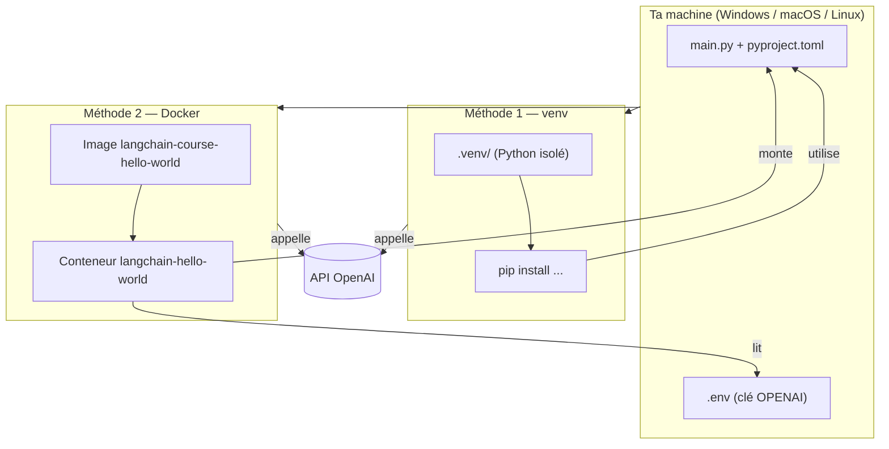

<a id="top"></a>

# Module 00 — Pratique : Hello World en venv et en Docker

> Ton premier "Hello World" LangChain, **deux fois** : une fois avec un environnement Python virtuel classique (venv + pip), une fois avec Docker. Tu vas voir exactement les mêmes commandes du LLM, mais lancées de deux façons différentes.

> [!NOTE]
> Si tu n'as pas encore lu le **[Module 0 — Introduction](./Module-00-introduction-LLM-LangChain-LangGraph-agent-RAG.md)** et fait le **[Module 0b — Quiz](./Module-00-quiz-introduction-LLM-LangChain-LangGraph-agent-RAG.md)**, fais-le d'abord. Ce document suppose que tu sais ce qu'est LangChain, un LLM et un prompt.

## Table des matières

| #   | Section                                                                |
| --- | ---------------------------------------------------------------------- |
| 1   | [Pourquoi tester les deux méthodes](#section-1)                        |
| 2   | [Vue d'ensemble](#section-2)                                           |
| 3   | [Prérequis communs](#section-3)                                        |
| 4   | [Méthode 1 — venv + pip (Python natif)](#section-4)                    |
| 4a  | &nbsp;&nbsp;↳ [Variante Ollama (local, sans clé)](#section-4a)         |
| 5   | [Méthode 2 — Docker](#section-5)                                       |
| 5a  | &nbsp;&nbsp;↳ [Lecture commentée du Dockerfile](#section-5a)           |
| 5b  | &nbsp;&nbsp;↳ [Lecture commentée du docker-compose.yml](#section-5b)   |
| 6   | [Comparatif venv vs Docker](#section-6)                                |
| 7   | [Comprendre la sortie du programme](#section-7)                        |
| 8   | [Troubleshooting (erreurs fréquentes)](#section-8)                     |
| 9   | [Conclusion et prochaine étape](#section-9)                            |

---

<a id="section-1"></a>

## 1. Pourquoi tester les deux méthodes

<details>
<summary>1 - L'idée pédagogique</summary>

<br/>

Tu vas rencontrer **les deux mondes** dans ta carrière :

- **venv + pip** : c'est la méthode **classique** Python. Tu installes Python sur ta machine, tu crées un dossier d'isolation (`.venv`) et tu installes les dépendances dedans avec `pip`. C'est ce que tu fais sur ton poste pour développer.
- **Docker** : tu emballes l'application **et** son environnement Python **et** ses dépendances dans une **image** portable. C'est ce que tu utilises pour déployer en production, partager avec un collègue, ou pour éviter de polluer ta machine.

> [!IMPORTANT]
> Les deux méthodes lancent **exactement le même `main.py`**. La seule différence, c'est **où** Python tourne (sur ta machine vs. dans un conteneur).

À la fin de ce document, tu sauras :

1. Créer un environnement virtuel Python proprement.
2. Installer LangChain via pip.
3. Lancer un script LangChain en local.
4. Lire un `Dockerfile` et un `docker-compose.yml`.
5. Builder une image Docker et lancer ton script dedans.
6. Diagnostiquer les erreurs courantes des deux côtés.

</details>

<p align="right"><a href="#top">↑ Retour en haut</a></p>

---

<a id="section-2"></a>

## 2. Vue d'ensemble



Les deux chemins font la même chose : configurer Python, installer LangChain, exécuter `main.py`, qui appelle l'API OpenAI.

<p align="right"><a href="#top">↑ Retour en haut</a></p>

---

<a id="section-3"></a>

## 3. Prérequis communs

<details>
<summary>3 - À installer une seule fois sur ta machine</summary>

<br/>

| Outil          | Pourquoi                                              | Méthode 1 (venv) | Méthode 2 (Docker) |
| -------------- | ----------------------------------------------------- | ---------------- | ------------------ |
| Python 3.11+   | Le langage du projet                                  | Obligatoire      | Pas nécessaire     |
| Docker Desktop | Pour exécuter le conteneur                            | Pas nécessaire   | Obligatoire        |
| Une clé OpenAI | Pour appeler `gpt-5` (ou `gpt-4o-mini`)               | Obligatoire      | Obligatoire        |
| Git            | Tu l'as déjà puisque tu as ce dépôt                   | Optionnel        | Optionnel          |

### Vérifier rapidement

**Windows (PowerShell) :**

```powershell
python --version
docker --version
```

**Linux / macOS :**

```bash
python3 --version
docker --version
```

> [!NOTE]
> Si `python` n'est pas trouvé sous Windows, essaie `py --version`. Sur macOS, c'est souvent `python3` (et `python` n'existe pas).

### Récupérer ta clé OpenAI

1. Va sur [platform.openai.com/api-keys](https://platform.openai.com/api-keys).
2. Clique sur "Create new secret key".
3. Copie la clé **immédiatement**, elle ne te sera plus jamais montrée.

> [!IMPORTANT]
> Ne **jamais** committer une clé d'API dans Git. C'est exactement le rôle du fichier `.env` (ignoré par `.gitignore`).

</details>

<p align="right"><a href="#top">↑ Retour en haut</a></p>

---

<a id="section-4"></a>

## 4. Méthode 1 — venv + pip (Python natif)

> Tu vas installer Python et les dépendances **directement sur ta machine**, mais **isolés dans un sous-dossier `.venv/`**. Si ton projet casse, tu supprimes `.venv/` et tu repars : ton Python système n'est pas touché.

### 4.1. Aller dans le dossier du projet

**Windows (PowerShell) :**

```powershell
cd c:\Users\rehou\Documents\00-dream\langchain-course-main\repositories\01-langchain-course-project-hello-world\langchain-course-project-hello-world
```

**Linux / macOS :**

```bash
cd repositories/01-langchain-course-project-hello-world/langchain-course-project-hello-world
```

> [!NOTE]
> Le double dossier (`01-...hello-world/langchain-course-project-hello-world`) est volontaire : le dossier extérieur regroupe la doc (`01-cours.md`, `Module-01-commandes-hello-world-LangChain.md`...) et le dossier intérieur contient le code Python.

### 4.2. Créer un environnement virtuel

**Windows (PowerShell) :**

```powershell
python -m venv .venv
```

**Linux / macOS :**

```bash
python3 -m venv .venv
```

Cela crée un dossier `.venv/` qui contient un Python isolé.

### 4.3. Activer l'environnement

C'est l'étape qui dit à ton terminal : « à partir de maintenant, utilise le Python du dossier `.venv/`, pas celui du système ».

**Windows (PowerShell) :**

```powershell
.\.venv\Scripts\Activate.ps1
```

**Windows (cmd.exe) :**

```cmd
.venv\Scripts\activate.bat
```

**Linux / macOS :**

```bash
source .venv/bin/activate
```

> [!IMPORTANT]
> Dès que c'est activé, tu vois `(.venv)` apparaître devant ton prompt :
> ```
> (.venv) PS C:\...\langchain-course-project-hello-world>
> ```
> Si tu ne vois pas ce préfixe, c'est que l'activation a échoué. Sous Windows PowerShell, il faut parfois autoriser les scripts une fois :
> ```powershell
> Set-ExecutionPolicy -Scope CurrentUser -ExecutionPolicy RemoteSigned
> ```

### 4.4. Mettre à jour pip (recommandé)

```bash
python -m pip install --upgrade pip
```

### 4.5. Installer les dépendances

Le projet a déjà un `pyproject.toml` qui liste tout. Deux façons de l'installer avec pip :

**Option A — Lire `pyproject.toml` directement :**

```bash
pip install .
```

Cela demande à pip d'utiliser le `pyproject.toml` du dossier courant et d'installer toutes les dépendances listées dedans.

**Option B — Installer chaque paquet à la main (plus explicite) :**

```bash
pip install langchain langchain-openai langchain-ollama python-dotenv
```

Pédagogiquement, l'option B est plus claire pour comprendre **ce qui est installé**. L'option A est plus pratique pour une vraie session.

### 4.6. Préparer le fichier `.env`

Le projet contient un fichier `.env.example`. Copie-le en `.env` et remplis ta clé.

**Windows (PowerShell) :**

```powershell
Copy-Item .env.example .env
notepad .env
```

**Linux / macOS :**

```bash
cp .env.example .env
nano .env  # ou code .env, vim .env, etc.
```

Le contenu attendu :

```bash
OPENAI_API_KEY=sk-proj-...   # colle ta vraie clé ici
```

> [!NOTE]
> Tu peux aussi ajouter `OPENAI_API_KEY` directement dans tes variables d'environnement système, mais utiliser un `.env` rend le projet portable et explicite.

### 4.7. Lancer le programme

```bash
python main.py
```

Si tout va bien, tu verras :

```
Hello from langchain-course!
1. Short summary: ...
2. Two interesting facts: ...
```

(Le contenu détaillé varie à chaque run, c'est normal — un LLM avec `temperature=0` reste assez stable mais pas 100 % identique.)

### 4.8. Désactiver l'environnement quand tu as fini

```bash
deactivate
```

Ton prompt redevient normal. Le dossier `.venv/` reste sur disque ; pour repartir d'une feuille blanche, supprime-le simplement.

**Windows :**

```powershell
Remove-Item -Recurse -Force .venv
```

**Linux / macOS :**

```bash
rm -rf .venv
```

<p align="right"><a href="#top">↑ Retour en haut</a></p>

---

<a id="section-4a"></a>

## 4a. Variante Ollama (local, sans clé)

<details>
<summary>4a - Lancer le même programme avec Ollama au lieu d'OpenAI</summary>

<br/>

Si tu n'as pas de clé OpenAI ou si tu veux travailler **100 % en local**, tu peux utiliser [Ollama](https://ollama.com/).

### Étapes

1. Installe Ollama : [https://ollama.com/download](https://ollama.com/download).
2. Télécharge un petit modèle :

   ```bash
   ollama pull gemma3:270m
   ```

3. Édite `main.py` : commente la ligne `ChatOpenAI(...)` et décommente `ChatOllama(...)` :

   ```python
   llm = ChatOllama(temperature=0, model="gemma3:270m")
   # llm = ChatOpenAI(temperature=0, model="gpt-5")
   ```

4. Tu n'as plus besoin de `OPENAI_API_KEY` dans ton `.env`.
5. Relance :

   ```bash
   python main.py
   ```

> [!NOTE]
> Les petits modèles Ollama sont moins bons que GPT-5/4o, mais ils sont gratuits et fonctionnent hors-ligne. Pour le `Hello World`, c'est largement suffisant.

</details>

<p align="right"><a href="#top">↑ Retour en haut</a></p>

---

<a id="section-5"></a>

## 5. Méthode 2 — Docker

> Cette fois, **tu n'installes rien** sur ta machine à part Docker Desktop. Python, pip et toutes les dépendances vivront dans un **conteneur**. Tu lances une commande, tu obtiens le même résultat. C'est aussi la méthode la plus proche de ce que tu utiliseras en production.

### 5.1. Vérifier que Docker tourne

**Windows / Linux / macOS :**

```bash
docker info
```

Si tu vois des informations sur ton moteur Docker, c'est OK. Sinon, lance Docker Desktop et attends qu'il soit démarré.

### 5.2. Aller dans le dossier du projet

Pareil que pour la méthode venv :

```bash
cd repositories/01-langchain-course-project-hello-world/langchain-course-project-hello-world
```

### 5.3. Préparer le `.env`

```bash
cp .env.example .env
# Édite .env et renseigne OPENAI_API_KEY
```

(Sous PowerShell : `Copy-Item .env.example .env` puis `notepad .env`.)

### 5.4. Construire l'image et lancer le conteneur

```bash
docker compose up --build
```

Cette commande fait deux choses d'un coup :

1. **Build** — lit le `Dockerfile`, télécharge `python:3.12-slim`, installe `uv`, copie ton code, installe les dépendances. Ça produit une **image** appelée `langchain-course-hello-world:latest`.
2. **Up** — démarre un conteneur basé sur cette image, lui passe le fichier `.env`, exécute `python main.py`.

> [!NOTE]
> Le premier `--build` est lent (téléchargement de Python, installation des paquets). Les fois suivantes, Docker garde ses caches et ça prend quelques secondes seulement.

Tu verras un log qui ressemble à :

```text
[+] Running 1/1
 ✔ Container langchain-hello-world  Created
Attaching to langchain-hello-world
langchain-hello-world  | Hello from langchain-course!
langchain-hello-world  | 1. Short summary: ...
langchain-hello-world  | 2. Two interesting facts: ...
langchain-hello-world exited with code 0
```

### 5.5. Arrêter et nettoyer

Quand tu as fini :

```bash
docker compose down
```

Cela arrête et supprime le conteneur. **L'image** reste cachée en local pour la prochaine fois (c'est ça qui fait que les runs suivants sont rapides).

Pour aussi supprimer l'image :

```bash
docker compose down --rmi local
```

Pour aussi supprimer les volumes (réinitialisation totale) :

```bash
docker compose down -v --rmi local
```

### 5.6. Relancer plus rapidement

Si tu n'as **pas** modifié les dépendances (`pyproject.toml` ou `uv.lock`), tu peux relancer sans rebuild :

```bash
docker compose up
```

Si tu as modifié seulement `main.py`, le **bind mount** `.:/app` du `docker-compose.yml` fait que tes changements sont **immédiatement visibles** dans le conteneur — pas besoin de rebuild non plus, juste relance.

<p align="right"><a href="#top">↑ Retour en haut</a></p>

---

<a id="section-5a"></a>

## 5a. Lecture commentée du Dockerfile

<details>
<summary>5a - Comprendre ligne par ligne ce que fait le Dockerfile</summary>

<br/>

```dockerfile
FROM python:3.12-slim
```

On part d'une image officielle Python 3.12 minimale. C'est notre point de départ.

```dockerfile
ENV UV_COMPILE_BYTECODE=1 \
    UV_LINK_MODE=copy \
    UV_PYTHON_DOWNLOADS=never \
    PYTHONUNBUFFERED=1
```

Variables d'environnement :
- `UV_COMPILE_BYTECODE=1` : pré-compile les `.pyc` pour démarrer plus vite.
- `UV_LINK_MODE=copy` : copie les fichiers au lieu de les hardlinker (compatibilité Windows).
- `UV_PYTHON_DOWNLOADS=never` : interdit à uv de télécharger un Python supplémentaire.
- `PYTHONUNBUFFERED=1` : Python n'attend plus avant de flusher `print()` (logs immédiats).

```dockerfile
COPY --from=ghcr.io/astral-sh/uv:0.5.11 /uv /uvx /bin/
```

Récupère le binaire `uv` depuis une autre image officielle (technique multi-stage). Tu obtiens `uv` dans `/bin/` sans installer Rust ou autre.

```dockerfile
WORKDIR /app
```

Crée et entre dans `/app`. Toutes les commandes suivantes partent de là.

```dockerfile
COPY pyproject.toml uv.lock ./
RUN uv sync --frozen --no-install-project
```

Étape clé pour le **cache Docker** :
1. On copie d'abord juste les fichiers de dépendances.
2. On installe les dépendances.
3. Cette couche sera mise en cache. Tant que `pyproject.toml` ne change pas, Docker n'a pas besoin de réinstaller.

```dockerfile
COPY . .
RUN uv sync --frozen
```

On copie tout le code (qui change souvent) **après** les dépendances. Puis on finalise l'install (cette fois en incluant le projet lui-même).

```dockerfile
ENV PATH="/app/.venv/bin:$PATH"
```

Met le venv créé par `uv` dans le `PATH`. Ainsi `python` pointera vers le bon Python.

```dockerfile
CMD ["python", "main.py"]
```

Commande par défaut quand le conteneur démarre : exécuter notre script.

> [!NOTE]
> Même si l'image utilise `uv` à l'intérieur, **toi** tu n'as pas besoin de connaître `uv` pour utiliser ce Dockerfile. C'est là toute la beauté de Docker : tu n'utilises que ce qui te concerne.

</details>

<p align="right"><a href="#top">↑ Retour en haut</a></p>

---

<a id="section-5b"></a>

## 5b. Lecture commentée du docker-compose.yml

<details>
<summary>5b - Le rôle de chaque ligne</summary>

<br/>

```yaml
services:
  app:
    build: .
```

On déclare un seul **service** appelé `app`. `build: .` dit à Compose : « pour fabriquer l'image, lis le Dockerfile du dossier courant ».

```yaml
    image: langchain-course-hello-world:latest
```

Nom donné à l'image construite. Sans cette ligne, Compose en choisirait un automatiquement.

```yaml
    container_name: langchain-hello-world
```

Nom du conteneur en cours d'exécution. Pratique pour `docker logs langchain-hello-world` ou `docker exec -it langchain-hello-world bash`.

```yaml
    env_file:
      - .env
```

Compose lit ton fichier `.env` et l'injecte dans le conteneur. C'est **la** raison pour laquelle ton `OPENAI_API_KEY` est disponible dans `os.environ` côté Python.

```yaml
    volumes:
      - .:/app
      - /app/.venv
```

Deux volumes :
1. `.:/app` — **bind mount**. Ton dossier hôte est monté en lecture/écriture dans `/app`. Si tu modifies `main.py` sur ton PC, le conteneur le voit instantanément.
2. `/app/.venv` — volume **anonyme** qui protège le `.venv` du conteneur. Sans ça, le bind mount écraserait le venv installé pendant le build.

```yaml
    stdin_open: true
    tty: true
```

Permet à `docker compose up` d'attacher un terminal interactif (utile si ton script fait `input(...)` ou si tu veux faire `docker compose run app bash`).

> [!IMPORTANT]
> **Comprends bien la magie du `volumes: - .:/app`.** C'est ce qui te permet de modifier ton code et de relancer sans rebuild. Sans ça, chaque modif imposerait `docker compose up --build`.

</details>

<p align="right"><a href="#top">↑ Retour en haut</a></p>

---

<a id="section-6"></a>

## 6. Comparatif venv vs Docker

<details>
<summary>6 - Quand choisir l'un ou l'autre</summary>

<br/>

| Critère                              | venv (Méthode 1)                        | Docker (Méthode 2)                                  |
| ------------------------------------ | --------------------------------------- | --------------------------------------------------- |
| Faut-il Python installé sur l'hôte ? | Oui                                     | Non                                                 |
| Faut-il Docker installé sur l'hôte ? | Non                                     | Oui                                                 |
| Premier démarrage                    | Rapide (< 1 min après pip install)      | Lent (build de l'image, plusieurs minutes)          |
| Démarrage suivant                    | Instantané                              | Très rapide (cache Docker)                          |
| Isolation                            | Bonne (venv) mais partage l'OS hôte     | Excellente (process isolé, FS isolé, réseau isolé)  |
| Reproductibilité entre machines      | Moyenne (dépend du Python local)        | Très élevée (la même image partout)                 |
| Édition rapide du code               | Idéale (lance directement)              | Idéale aussi grâce au bind mount `.:/app`           |
| Debug interactif (breakpoints IDE)   | Très simple                             | Plus complexe (remote debugger ou attaches)         |
| Partage avec un collègue             | Tu envoies tes instructions             | Tu envoies l'image, ça marche partout               |
| Idéal pour                           | Développement quotidien                 | CI/CD, démos, déploiement, environnements partagés  |

### Règle simple

- **Tu apprends, tu codes ?** → venv.
- **Tu veux montrer ton projet sans que l'autre installe Python ?** → Docker.
- **Tu déploies ?** → Docker.
- **Tu utilises plusieurs services (LLM + base + UI) ?** → Docker Compose.

> [!NOTE]
> En pratique, beaucoup de développeurs LangChain utilisent **venv en local** pour développer et **Docker Compose en CI/CD ou en démo**. Tu n'as pas à choisir une fois pour toutes.

</details>

<p align="right"><a href="#top">↑ Retour en haut</a></p>

---

<a id="section-7"></a>

## 7. Comprendre la sortie du programme

<details>
<summary>7 - Disséquer ce qui se passe quand tu lances main.py</summary>

<br/>

Que tu sois en venv ou en Docker, le déroulé est le même.

### Étape 1 — `load_dotenv()`

```python
load_dotenv()
```

Lit le fichier `.env` et expose chaque ligne `CLE=valeur` comme variable d'environnement (`os.environ["OPENAI_API_KEY"]`).

### Étape 2 — Construction du prompt

```python
summary_template = """
given the information {information} about a person I want you to create:
1. A short summary
2. two interesting facts about them
"""

summary_prompt_template = PromptTemplate(
    input_variables=["information"], template=summary_template
)
```

`{information}` est une **variable** dans le gabarit. À l'exécution, elle sera remplacée par le vrai texte sur Elon Musk.

### Étape 3 — Instanciation du LLM

```python
llm = ChatOpenAI(temperature=0, model="gpt-5")
```

`temperature=0` rend la réponse aussi déterministe que possible. `model="gpt-5"` choisit le moteur.

### Étape 4 — Composition de la chaîne

```python
chain = summary_prompt_template | llm
```

C'est l'opérateur LCEL `|`. Lecture : « envoie l'input dans le prompt, sa sortie dans le LLM ».

### Étape 5 — Invocation

```python
response = chain.invoke(input={"information": information})
print(response.content)
```

`chain.invoke({...})` :
1. Remplit le gabarit avec le texte sur Elon Musk.
2. Envoie le prompt formaté à l'API OpenAI.
3. Reçoit un `AIMessage` dont l'attribut `content` contient le texte de la réponse.

### Sortie attendue (résumée)

```text
Hello from langchain-course!
1. Short summary: Elon Musk is a businessman known for leading Tesla, SpaceX...
2. Two interesting facts: He was the largest donor in the 2024 U.S. presidential election...
```

</details>

<p align="right"><a href="#top">↑ Retour en haut</a></p>

---

<a id="section-8"></a>

## 8. Troubleshooting (erreurs fréquentes)

<details>
<summary>8 - Les bugs que tu vas probablement rencontrer</summary>

<br/>

### 8.1. `ModuleNotFoundError: No module named 'langchain_openai'`

**Cause :** tu as oublié d'activer ton venv (Méthode 1) ou tu as installé les paquets dans le mauvais Python.

**Fix :**
- Vérifie que tu vois bien `(.venv)` devant ton prompt.
- Sinon, réactive : `.\.venv\Scripts\Activate.ps1` (Windows) ou `source .venv/bin/activate` (Linux/macOS).
- Réinstalle si besoin : `pip install langchain langchain-openai langchain-ollama python-dotenv`.

### 8.2. `OPENAI_API_KEY environment variable not set`

**Cause :** ton `.env` n'est pas lu, ou la clé n'y est pas, ou tu l'as mal écrite.

**Fix :**
- Vérifie que `.env` existe dans le **même dossier** que `main.py`.
- Ouvre-le et vérifie : pas d'espace autour du `=`, pas de guillemets autour de la valeur.

  ```bash
  OPENAI_API_KEY=sk-proj-abc...   # OK
  OPENAI_API_KEY = sk-proj-abc... # KO (espaces)
  OPENAI_API_KEY="sk-proj-abc..." # parfois KO selon le shell
  ```

- Confirme que `load_dotenv()` est bien appelé **avant** d'instancier `ChatOpenAI`.

### 8.3. `openai.NotFoundError: model 'gpt-5' does not exist`

**Cause :** ton compte OpenAI n'a pas accès à `gpt-5`.

**Fix :** dans `main.py`, remplace :

```python
llm = ChatOpenAI(temperature=0, model="gpt-5")
```

par :

```python
llm = ChatOpenAI(temperature=0, model="gpt-4o-mini")
```

### 8.4. (Windows) `... Activate.ps1 cannot be loaded because running scripts is disabled`

**Cause :** PowerShell bloque l'exécution des scripts par défaut.

**Fix (à faire une fois pour toutes) :**

```powershell
Set-ExecutionPolicy -Scope CurrentUser -ExecutionPolicy RemoteSigned
```

Réponds `Y` à la demande de confirmation.

### 8.5. `docker: command not found` ou `Cannot connect to the Docker daemon`

**Cause :** Docker n'est pas installé ou Docker Desktop n'est pas démarré.

**Fix :**
- Installe Docker Desktop : [docker.com/products/docker-desktop](https://www.docker.com/products/docker-desktop/).
- Lance-le et attends qu'il dise "Docker Desktop is running".
- Reteste avec `docker info`.

### 8.6. (Docker) `permission denied while trying to connect to the Docker daemon socket` (Linux)

**Cause :** ton utilisateur n'est pas dans le groupe `docker`.

**Fix :**

```bash
sudo usermod -aG docker $USER
# Puis déconnecte-toi et reconnecte-toi (ou redémarre)
```

### 8.7. (Docker) Le rebuild prend toujours autant de temps

**Cause :** tu modifies `pyproject.toml` régulièrement, ce qui invalide le cache Docker dès la première étape.

**Fix :** ne touche à `pyproject.toml` que quand tu changes vraiment les dépendances. Pour modifier juste ton code, le bind mount `.:/app` rend le rebuild inutile. Lance simplement :

```bash
docker compose up
```

### 8.8. `RateLimitError` ou `InsufficientQuota` (OpenAI)

**Cause :** ta clé OpenAI n'a pas de crédit ou tu as dépassé ton quota.

**Fix :** ajoute du crédit sur ton compte OpenAI ou crée une nouvelle clé sur un autre compte.

> [!NOTE]
> Tu peux aussi basculer sur Ollama (voir [section 4a](#section-4a)) qui est 100 % local et gratuit.

</details>

<p align="right"><a href="#top">↑ Retour en haut</a></p>

---

<a id="section-9"></a>

## 9. Conclusion et prochaine étape

<details>
<summary>9 - Ce que tu sais faire maintenant</summary>

<br/>

Tu as exécuté **deux fois** le même Hello World :

1. Avec **venv + pip** : tu sais isoler un environnement Python et installer des paquets.
2. Avec **Docker** : tu sais builder une image, lancer un conteneur, lire un Dockerfile et un docker-compose.yml.

Tu maîtrises aussi :

- la séparation `pyproject.toml` (déclaratif) vs. `pip install` (impératif),
- le rôle du `.env` et de `load_dotenv()`,
- le bind mount Docker qui rend le rebuild inutile,
- la liste des erreurs courantes et leurs fixes.

### Prochaine étape

→ **[Module 1 — Hello World LangChain (cours détaillé)](./01-cours.md)** : maintenant qu'il tourne, **comprends le code ligne par ligne** : `PromptTemplate`, LCEL, `chain.invoke()`, `temperature=0`.

→ **[Module 2 — Search Agent](../02-langchain-course-project-search-agent/01-cours.md)** : passer du simple appel LLM à un **agent** qui appelle des outils.

> [!IMPORTANT]
> Conserve cette pratique en référence. À chaque nouveau module, tu retrouveras le même duo de méthodes (venv + Docker) — c'est ton réflexe à acquérir avant tout le reste.

</details>

<p align="right"><a href="#top">↑ Retour en haut</a></p>

---

<p align="center">
  <strong>Fin du Module 0c — Pratique Hello World (venv + Docker)</strong><br/>
  <a href="#top">↑ Retour en haut</a>
</p>
