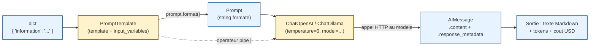
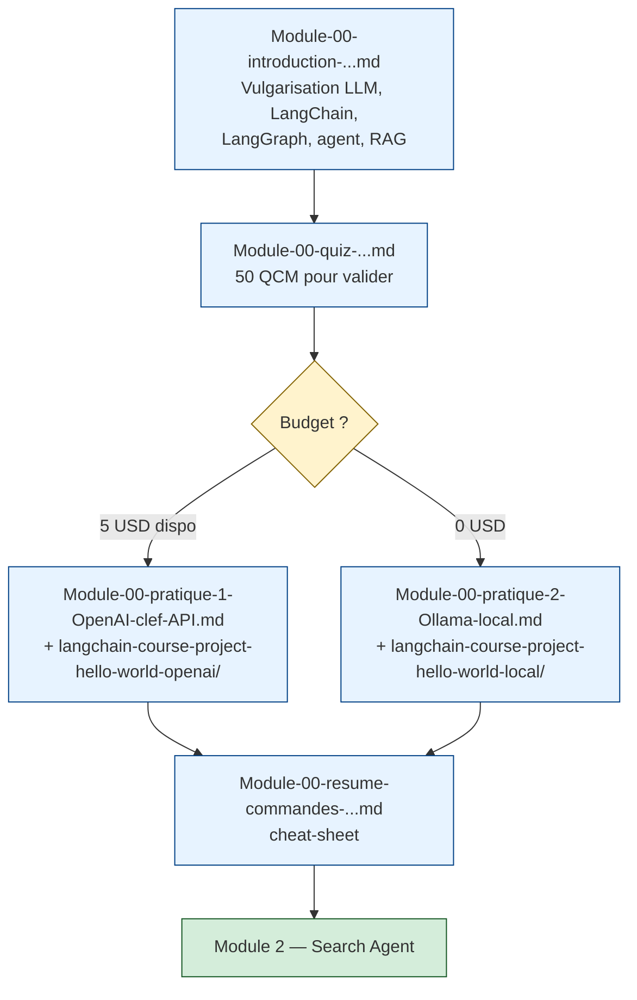

# Module 0 — Introduction à LangChain et IA Agentique

Ce module est le point d'entrée du cours. Il combine **vocabulaire** (LLM, LangChain, LangGraph, IA agentique, RAG) et **premier projet pratique** (Hello World) en français.

---

## Table des matières

| Document | Description | Pour qui ? |
|---|---|---|
| [Module-00-introduction-LLM-LangChain-LangGraph-agent-RAG.md](Module-00-introduction-LLM-LangChain-LangGraph-agent-RAG.md) | Cours vulgarisé sans code | Débutant complet |
| [Module-00-quiz-introduction-LLM-LangChain-LangGraph-agent-RAG.md](Module-00-quiz-introduction-LLM-LangChain-LangGraph-agent-RAG.md) | 50 questions QCM | Valider l'intro |
| [Module-00-pratique-1-OpenAI-clef-API.md](Module-00-pratique-1-OpenAI-clef-API.md) | Pas-à-pas Hello World **OpenAI** (payant) | Voie qualité max |
| [Module-00-pratique-2-Ollama-local.md](Module-00-pratique-2-Ollama-local.md) | Pas-à-pas Hello World **Ollama** (gratuit, local) | Voie sans carte bancaire |
| [Module-00-resume-commandes-hello-world-LangChain.md](Module-00-resume-commandes-hello-world-LangChain.md) | Cheat-sheet `uv` / `venv` / Docker | Mémo rapide |
| [`langchain-course-project-hello-world-openai/`](langchain-course-project-hello-world-openai/) | Code Python — version OpenAI | Pratique 1 |
| [`langchain-course-project-hello-world-local/`](langchain-course-project-hello-world-local/) | Code Python — version Ollama | Pratique 2 |

---

## 1. Ce que fait `main.py` — la chaîne LCEL en détail

Les deux `main.py` (`-openai/` et `-local/`) suivent **exactement la même structure** : trois briques LangChain composées avec l'opérateur `|` (pipe), puis invoquées sur trois entrées.

### Diagramme de la chaîne



### Le pattern « 3 briques + pipe »

| Brique | Classe | Rôle | Méthode appelée |
|---|---|---|---|
| **1. Le formulaire** | `PromptTemplate` | Définit un template texte avec des trous (`{information}`) qui seront remplis à chaque appel | `.format(**kwargs)` (implicite via la chaîne) |
| **2. Le cerveau** | `ChatOpenAI` ou `ChatOllama` | Encapsule l'API du LLM, gère le format des messages, l'authentification, la température, le modèle | `.invoke(prompt_string)` → renvoie un `AIMessage` |
| **3. Le tuyau** | `RunnableSequence` (créé par `|`) | Compose les deux briques en un objet réutilisable | `.invoke(dict_d_entree)` |

### Code commenté (extrait de `main.py`)

```python
from langchain_core.prompts import PromptTemplate
from langchain_openai import ChatOpenAI   # ou: from langchain_ollama import ChatOllama

template = """
A partir de l'information suivante :

{information}

Donne, en francais et en Markdown court :
1. Un resume en une seule phrase.
2. Deux faits interessants peu connus.
3. Une question ouverte a creuser.
"""

prompt = PromptTemplate(
    input_variables=["information"],   # liste des trous a remplir
    template=template,                 # le texte avec {information}
)

llm = ChatOpenAI(temperature=0, model="gpt-4o-mini")

chain = prompt | llm                   # pipe LCEL : compose les 2 briques

reponse = chain.invoke({"information": "Elon Musk ..."})
print(reponse.content)                 # le texte genere
print(reponse.response_metadata)       # {'token_usage': {...}, 'model_name': '...'}
```

### Méthodes clés à connaître

| Appel | Que fait-il ? | Quand l'utiliser ? |
|---|---|---|
| `PromptTemplate(input_variables=, template=)` | Construit un objet template réutilisable | Une fois au démarrage |
| `prompt \| llm` | Compose en un `RunnableSequence` (LCEL) | Une fois au démarrage |
| `chain.invoke(dict)` | Exécute la chaîne sur **une** entrée et bloque jusqu'à la réponse | À chaque appel |
| `chain.stream(dict)` | Renvoie un itérateur de tokens au fur et à mesure | Pour streamer dans une UI |
| `chain.batch([dict, dict, ...])` | Lance plusieurs appels en parallèle | Pour traiter une liste rapidement |
| `chain.ainvoke(dict)` / `astream` / `abatch` | Versions asynchrones | Dans du code `async` (FastAPI, etc.) |
| `reponse.content` | Le texte généré par le LLM | Pour afficher / parser |
| `reponse.response_metadata` | Dictionnaire `{token_usage, model_name, finish_reason, ...}` | Pour mesurer coût et qualité |

### Le bonus pédagogique du `main.py`

Au-delà du squelette LCEL, le `main.py` ajoute :

- `banner(titre, char)` — fonction d'affichage pour structurer la console.
- `cout_usd(tokens_in, tokens_out, modele)` — *(version OpenAI uniquement)* calcule le coût USD à partir des tarifs `TARIFS_OPENAI`.
- Boucle `for i, (nom, info) in enumerate(personnages.items())` — invoque la **même chaîne** sur **3 personnages** (Elon Musk, Marie Curie, Albert Einstein) pour montrer concrètement la réutilisation.
- `try / except Exception` autour de `chain.invoke()` — capture explicitement les erreurs (rate limit, timeout, modèle absent…) sans tuer la boucle.
- Compteur `succes` et `cout_total` — résumé final avec timing global, coût et taux de réussite.

> Pour la **vulgarisation** des concepts (LLM, prompt, embedding, agent, RAG), lis d'abord [Module-00-introduction-LLM-LangChain-LangGraph-agent-RAG.md](Module-00-introduction-LLM-LangChain-LangGraph-agent-RAG.md).

---

## 2. Démarrage rapide — l'essentiel

Choisis **une seule** voie selon ton budget :

### Voie A — Docker + OpenAI (recommandée si tu as 5 USD de crédit OpenAI)

```bash
cd langchain-course-project-hello-world-openai
cp .env.example .env
# Edite .env : OPENAI_API_KEY=sk-proj-...
docker compose up --build
```

### Voie B — Docker + Ollama local (recommandée si tu veux gratuit)

```bash
ollama serve              # terminal separe
ollama pull gemma3:270m   # une seule fois

cd langchain-course-project-hello-world-local
cp .env.example .env
# Edite .env : decommente OLLAMA_BASE_URL=http://host.docker.internal:11434
docker compose up --build
```

### Voie C — Natif `uv` (sans Docker)

```bash
# OpenAI
cd langchain-course-project-hello-world-openai
cp .env.example .env   # remplir OPENAI_API_KEY
uv sync
uv run python main.py

# OU Ollama (apres ollama serve + ollama pull gemma3:270m)
cd langchain-course-project-hello-world-local
cp .env.example .env   # peut rester vide en natif
uv sync
uv run python main.py
```

> Pour le pas-à-pas complet (création de compte OpenAI, installation Ollama, mode interactif Docker, dépannage), ouvre la pratique correspondante : [Pratique 1](Module-00-pratique-1-OpenAI-clef-API.md) ou [Pratique 2](Module-00-pratique-2-Ollama-local.md). Pour un mémo encore plus court : [Résumé des commandes](Module-00-resume-commandes-hello-world-LangChain.md).

---

## 3. Sortie attendue (résumé)

```
========================================================================
  LangChain Hello World - <OpenAI ou Ollama local> - PromptTemplate + LCEL
========================================================================
[1/4] Construction du PromptTemplate ...
[2/4] Initialisation du LLM ...
[3/4] Composition de la chaine LCEL : prompt | llm
[4/4] Invocation de la chaine sur 3 personnages historiques

------------------------------------------------------------------------
  1/3 - Elon Musk
------------------------------------------------------------------------
Appel LLM en cours ... [OK] 4.5s
# Resume ...
## Faits interessants peu connus ...
## Question ouverte a creuser ...

... (idem pour Marie Curie et Albert Einstein) ...

========================================================================
  Termine en 13.2s (3/3 reussis)
========================================================================
```

---

## 4. Parcours suggéré



**Module suivant** : [Module 2 — Search Agent](../02-langchain-course-project-search-agent/01-cours.md) — passe d'un simple appel LLM à un agent qui appelle des outils externes.
